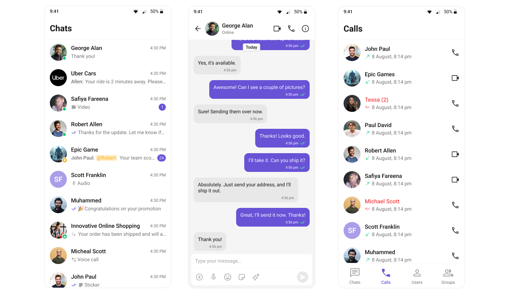

  

# CometChat Android UI Kit

The CometChat Android UI Kit provides a pre-built user interface kit that developers can use to quickly integrate a reliable & fully-featured chat
experience into an existing or a new app.

   

## Prerequisites

- Android Studio
- Android Device or emulator with Android version 6.0 or above.
- Java 8 or above.

## Getting Started

To set up CometChat Android UI Kit and utilize CometChat for your chat functionality, you'll need to follow these steps:

1. Register at the [CometChat Dashboard](https://app.cometchat.com/) to create an account.

2. After registering, log into your CometChat account and create a new app. Once created, CometChat will generate an Auth Key and App ID for you. Keep
   these credentials secure as you'll need them later.

3. Check the [Key Concepts](https://www.cometchat.com/docs/android-uikit/key-concepts) to understand the basic components of CometChat.

4. Refer to the [Integration Steps](https://www.cometchat.com/docs/android-uikit/integration) in our documentation to integrate the UI Kit into your
   Android app.

## Help and Support

For issues running the project or integrating with our UI Kits, consult our [documentation](https://www.cometchat.com/docs/android-uikit/integration)
or create a [support ticket](https://help.cometchat.com/hc/en-us) or seek real-time support via the [CometChat Dashboard](https://app.cometchat.com/).
