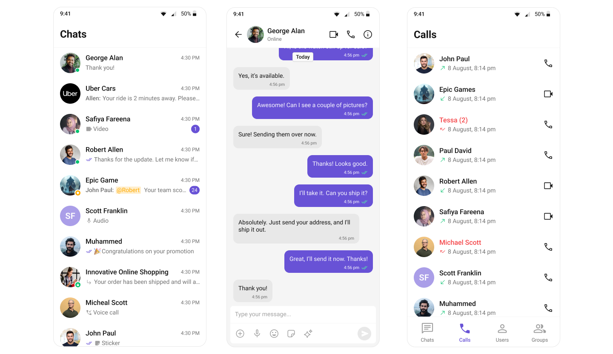

<p align="center">
  
</p>

# CometChat Android UI Kit

The CometChat Android UI Kit provides a pre-built user interface kit that developers can use to quickly integrate a reliable & fully-featured chat
experience into an existing or a new app.


<div style="
    display: flex;
    align-items: center;
    justify-content: center;">
   
</div>

## Prerequisites

- Android Studio
- Android device or emulator running Android 9.0 (API 28) or above.
- Java 11 or above.

## Installation

The UI Kit is published to CometChat's Cloudsmith Maven repository, which is not
one of Gradle's defaults — add it in `settings.gradle` alongside `google()` and
`mavenCentral()`:

```groovy
dependencyResolutionManagement {
    repositories {
        google()
        mavenCentral()
        maven { url "https://dl.cloudsmith.io/public/cometchat/cometchat/maven/" }
    }
}
```

Then add the toolkit you want. Both bring in `chatuikit-core` transitively, so
you do not need to declare it yourself:

```kotlin
// Jetpack Compose
implementation("com.cometchat:chatuikit-compose-android:")

// or XML views
implementation("com.cometchat:chatuikit-kotlin-android:")
```

### Voice and video calling (optional)

Calling ships separately. The UI Kit is compiled against the Calls SDK but does
not depend on it: the dependency is `compileOnly`, so it is **absent from the
published POMs** and Gradle will not pull it in for you. Add it yourself if you
use any calling feature:

```kotlin
implementation("com.cometchat:calls-sdk-android:5.0.2")
```

If you omit it the project still compiles, because nothing in the UI Kit
requires it at build time — but the first call into a calling feature fails at
runtime with `ClassNotFoundException` for
`com.cometchat.calls.core.CometChatCalls`. Use the version above; it is the one
this release is built and tested against.

## Getting Started

To set up CometChat Android UI Kit and utilize CometChat for your chat functionality, you'll need to follow these steps:

1. Register at the [CometChat Dashboard](https://app.cometchat.com/) to create an account.

2. After registering, log into your CometChat account and create a new app. Once created, CometChat will generate an Auth Key and App ID for you. Keep
   these credentials secure as you'll need them later.

3. Check the [Key Concepts](https://www.cometchat.com/docs/android-uikit/key-concepts) to understand the basic components of CometChat.

4. Refer to the [Integration Steps](https://www.cometchat.com/docs/android-uikit/integration) in our documentation to integrate the UI Kit into your
   Android app.

## Help and Support

For issues running the project or integrating with our UI Kits, consult our [documentation](https://www.cometchat.com/docs/android-uikit/integration)
or create a [support ticket](https://help.cometchat.com/hc/en-us) or seek real-time support via the [CometChat Dashboard](https://app.cometchat.com/).
